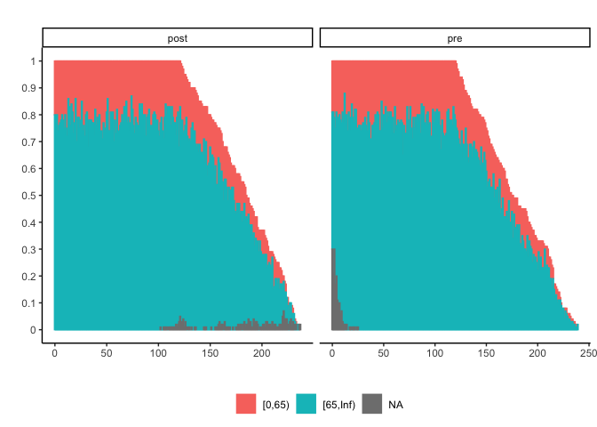
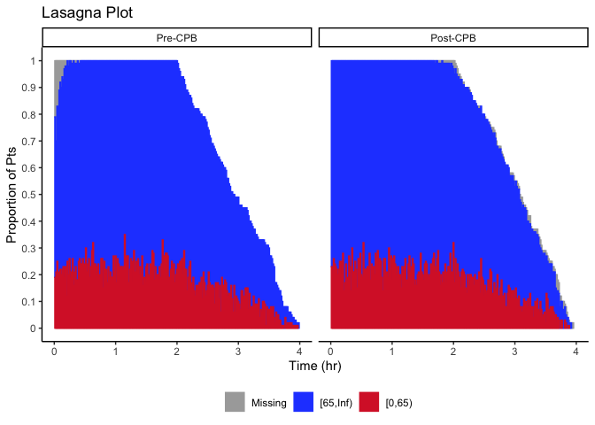

<!-- README.md is generated from README.Rmd. Please edit that file -->

# bloodlines

<!-- badges: start -->
<!-- badges: end -->

The goal of bloodlines is to generate nice plots for hemodynamics data.

## Installation

You can install the development version of bloodlines from
[GitHub](https://github.com/) with:

``` r
# install.packages("pak")
pak::pak("jhuwit/bloodlines")
#> ℹ Loading metadata database✔ Loading metadata database ... done
#>  
#> → Will update 1 package.
#> → Will download 1 package with unknown size.
#> + bloodlines 0.0.0.9000 → 0.0.0.9000 👷🏾🔧 ⬇ (GitHub: d9260f0)
#> ℹ Getting 1 pkg with unknown size
#> ✔ Got bloodlines 0.0.0.9000 (source) (1.59 MB)
#> ℹ Packaging bloodlines 0.0.0.9000
#> ✔ Packaged bloodlines 0.0.0.9000 (1.1s)
#> ℹ Building bloodlines 0.0.0.9000
#> ✔ Built bloodlines 0.0.0.9000 (4.1s)
#> ✔ Installed bloodlines 0.0.0.9000 (github::jhuwit/bloodlines@d9260f0) (65ms)
#> ✔ 1 pkg + 32 deps: kept 20, upd 1, dld 1 (NA B) [18.6s]
```

## Lasagna plots

``` r
library(bloodlines)
## basic example code
data(sample_df)
plot_lasagna(sample_df %>% dplyr::filter(cat_cpb != "intra"),
             facet_var = "cat_cpb",
             layer_var = "map_cat")
```



``` r

## we can use our own colors
sample_df_clean = 
  sample_df %>% 
  dplyr::filter(cat_cpb != "intra") %>% 
  dplyr::mutate(map_cat = forcats::fct_na_value_to_level(map_cat, level = "Missing"),
                map_cat = forcats::fct_rev(map_cat),
                cat_cpb = factor(cat_cpb,
                                 levels = c("pre", "post"),
                                 labels = c("Pre-CPB", "Post-CPB")),
                time = time / 60)
cols = c("[0,65)" = "#D82632FF",
               "[65,Inf)" = "#264DFFFF",
               "Missing" = "darkgrey")

plot_lasagna(data = sample_df_clean,
             facet_var = "cat_cpb",
             layer_var = "map_cat",
             xlab = "Time (hr)",
             ylab = "Proportion of Pts",
             title = "Lasagna Plot",
             xlims = c(0, 4),
             xbreaks = seq(0, 4, 1),
             col_vector = cols)
#> Warning: Removed 5 rows containing missing values or values outside the scale range
#> (`geom_bar()`).
```



## Lasagna plots (time series version)

``` r

plot_ts_lasagna(sample_df %>% dplyr::filter(cat_cpb != "intra"),
             facet_var = "cat_cpb",
             layer_var = "map_cat")
```


``` r


plot_ts_lasagna(data = sample_df_clean,
             facet_var = "cat_cpb",
             layer_var = "map_cat",
             xlab = "Time (hr)",
             ylab = "Patient",
             title = "Time series lasagna Plot",
             xlims = c(0, 4),
             xbreaks = seq(0, 4, 1),
             col_vector = cols)
#> Warning: Removed 200 rows containing missing values or values outside the scale range
#> (`geom_tile()`).
```


