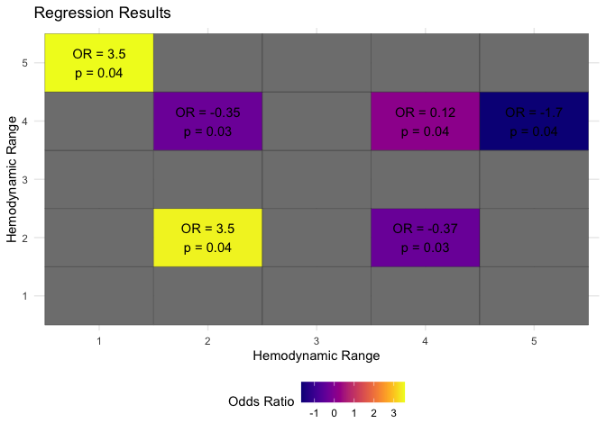

<!-- README.md is generated from README.Rmd. Please edit that file -->

# bloodlines

<!-- badges: start -->
<!-- badges: end -->

The goal of bloodlines is to generate nice plots for hemodynamics data.

## Installation

You can install the development version of bloodlines from
[GitHub](https://github.com/) with:

``` r
# install.packages("pak")
pak::pak("jhuwit/bloodlines")
#> ℹ Loading metadata database✔ Loading metadata database ... done
#>  
#> ℹ No downloads are needed
#> ✔ 1 pkg + 40 deps: kept 27 [8.9s]
```

## Lasagna plots

``` r
library(bloodlines)
## basic example code
data(sample_df)
plot_lasagna(sample_df %>% dplyr::filter(cat_cpb != "intra"),
             facet_var = "cat_cpb",
             layer_var = "cat_map")
```


``` r

## we can use our own colors
sample_df_clean = 
  sample_df %>% 
  dplyr::filter(cat_cpb != "intra") %>% 
  dplyr::mutate(cat_map = forcats::fct_na_value_to_level(cat_map, level = "Missing"),
                cat_map = forcats::fct_rev(cat_map),
                cat_cpb = factor(cat_cpb,
                                 levels = c("pre", "post"),
                                 labels = c("Pre-CPB", "Post-CPB")),
                time = time / 60)

# paletteer::paletteer_d("colorBlindness::Blue2DarkRed12Steps")
cols = c(
  "[0,65)" = "#D82632FF",
  "[65,Inf)" = "#264DFFFF",
  "Missing" = "darkgrey"
)

plot_lasagna(data = sample_df_clean,
             facet_var = "cat_cpb",
             layer_var = "cat_map",
             xlab = "Time (hr)",
             ylab = "Proportion of Pts",
             title = "Lasagna Plot",
             xlims = c(0, 4),
             xbreaks = seq(0, 4, 1),
             col_vector = cols)
#> Warning: Removed 5 rows containing missing values or values outside the scale range
#> (`geom_bar()`).
```


## Lasagna plots (time series version)

``` r
sample_df_clean2 = 
  sample_df_clean %>% 
  dplyr::group_by(id) %>% 
  dplyr::mutate(n = dplyr::n()) %>% 
  dplyr::ungroup() %>% 
  dplyr::mutate(id = forcats::fct_reorder(id, n))
plot_ts_lasagna(sample_df %>% dplyr::filter(cat_cpb != "intra"),
             facet_var = "cat_cpb",
             layer_var = "cat_map")
```


``` r


plot_ts_lasagna(data = sample_df_clean2,
             facet_var = "cat_cpb",
             layer_var = "cat_map",
             xlab = "Time (hr)",
             ylab = "Patient",
             title = "Time series lasagna Plot",
             xlims = c(0, 4),
             xbreaks = seq(0, 4, 1),
             col_vector = cols)
#> Warning: Removed 200 rows containing missing values or values outside the scale range
#> (`geom_tile()`).
```


\## Heatmap from regression results

``` r
data(reg_df)

plot_heatmap(data = reg_df,
             fill_lab = "Odds Ratio",
             xlab = "Hemodynamic Range",
             ylab = "Hemodynamic Range",
             title = "Regression Results",
             sig = TRUE,
             text_col = "black",
             fill_scheme = "gradient2")
```


``` r

## example using custom palette and only showing significance 
plot_heatmap(data = reg_df,
             fill_lab = "Odds Ratio",
             xlab = "Hemodynamic Range",
             ylab = "Hemodynamic Range",
             title = "Regression Results",
             sig = TRUE,
             text_col = "black",
             fill_scheme = "palette",
             palette = "viridis::plasma",
             show_only_sig = TRUE)
```



``` r

## example using number of colors 
plot_heatmap(data = reg_df,
             fill_lab = "Odds Ratio",
             xlab = "Hemodynamic Range",
             ylab = "Hemodynamic Range",
             title = "Regression Results",
             sig = TRUE,
             text_col = "black",
             fill_scheme = "gradientn",
             n_colors = 5)
```


## J plot from regression results

``` r
data(mult_reg_df)


plot_j(mult_reg_df, col_vec = c("A" = "#1E8E99", "B" = "#FF8E32"))
```


``` r


## example with facets 

facet_data =
  mult_reg_df %>%
  dplyr::mutate(v1 = "Pre-CPB") %>%
  dplyr::bind_rows(mult_reg_df %>% dplyr::mutate(v1 = "Post-CPB"))

plot_j(
  facet_data,
  col_vec = c("A" = "#1E8E99", "B" = "#FF8E32"),
  facet_var = "v1"
)
```


